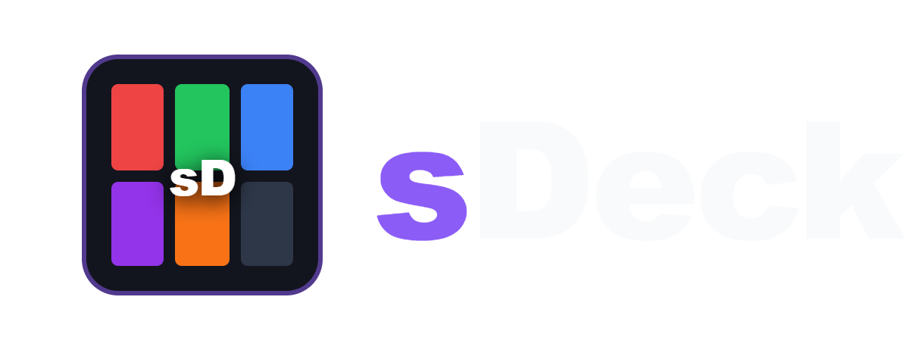
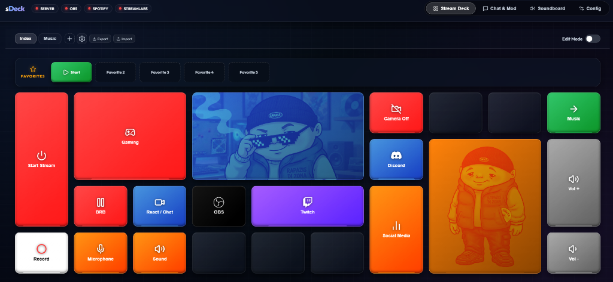
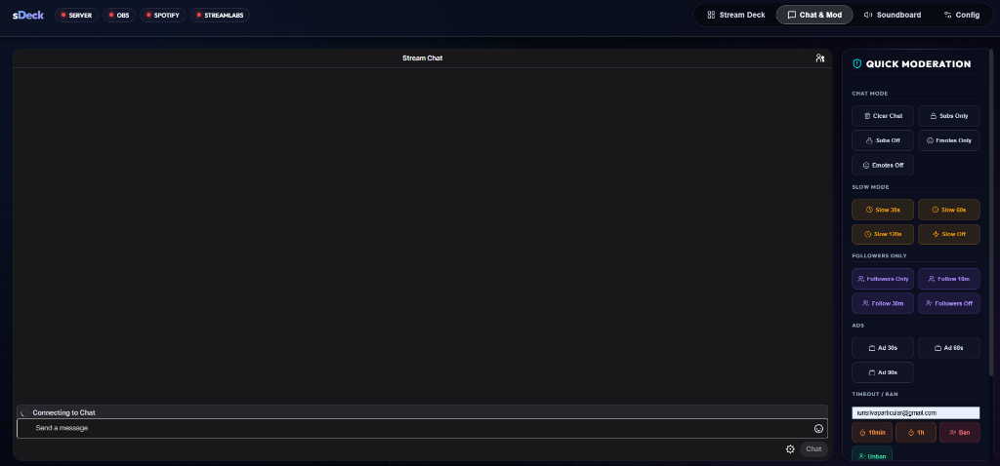
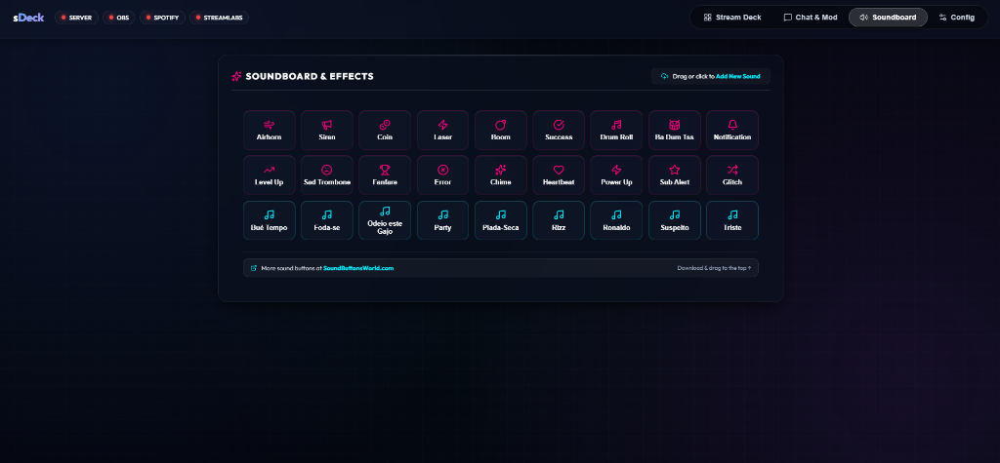
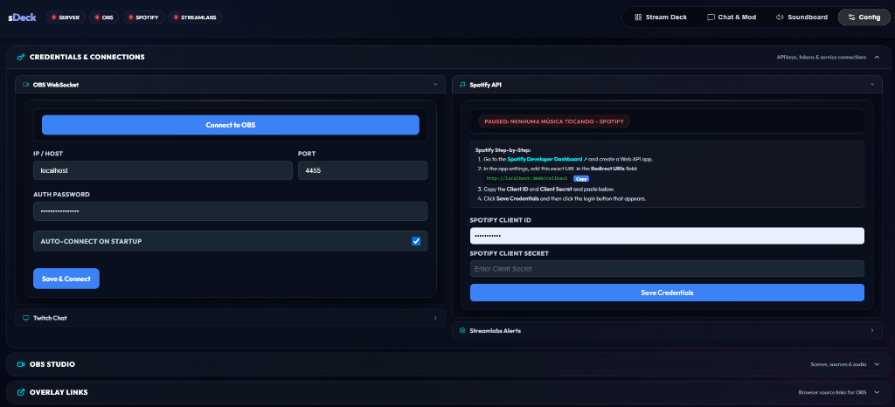

<div align="center">



<br/><br/>

[](https://nodejs.org/)
[](https://obsproject.com/)
[](https://opensource.org/licenses/MIT)
[](https://makeapullrequest.com)
[](https://github.com/itsiurisilva/sDeck)

**Host sDeck on your main computer and control OBS, Spotify, Twitch, and your PC from any device on your Wi-Fi network — no specialized hardware required.**

[**Quick Start**](#-quick-start) · [**Features**](#-features) · [**Screenshots**](#-screenshots) · [**Configuration**](#️-configuration) · [**Integrations**](#-integrations) · [**Overlays**](#-stream-overlays)

<br/>



</div>

<br/>

---

## ✨ Features

| | |
|---|---|
| 🖥️ **Fully Self-Hosted** | Runs entirely on your local machine — no cloud, no subscription, no external server. |
| 📱 **Any Device, Instant Access** | Open the deck on any phone, tablet, or secondary screen connected to your Wi-Fi. |
| 🎮 **OBS Studio Control** | Switch scenes, toggle sources, control streams & recording via WebSocket v5. |
| 🎵 **Spotify Integration** | Real-time now playing, play/pause, skip tracks, and volume control. |
| 💬 **Twitch Chat Macros** | Send announcements and automate chat messages mid-stream. |
| 🔔 **Streamlabs Alerts** | Trigger alert screens and sounds from live events in real time. |
| ⚡ **Custom Commands** | Chain PowerShell / CMD scripts, app launchers, and OBS actions into one button. |
| 🎙️ **Soundboard** | Instant local sound effects triggered directly from the deck. |

---

## 🚀 Quick Start

> **Requires** [Node.js](https://nodejs.org/) v18 or higher.

**1 — Clone the repository**
```bash
git clone https://github.com/itsiurisilva/sDeck.git
cd sDeck
```

**2 — Launch**

| OS | How |
|:---|:----|
| **Windows** | Double-click `INICIAR.bat` |
| **macOS / Linux** | `chmod +x start.sh && ./start.sh` |

**3 — Open the dashboard**
```
http://localhost:3000
```

> The launcher automatically installs dependencies, generates config templates, and opens your dashboard on first run.

---

## 📸 Screenshots

<table>
  <tr>
    <td align="center"><b>Stream Deck</b></td>
    <td align="center"><b>Chat & Moderation</b></td>
  </tr>
  <tr>
    <td></td>
    <td></td>
  </tr>
  <tr>
    <td align="center"><b>Soundboard</b></td>
    <td align="center"><b>Credentials & Config</b></td>
  </tr>
  <tr>
    <td></td>
    <td></td>
  </tr>
</table>

---

## ⚙️ Configuration

On first launch, sDeck generates three local config files:

| File | Purpose |
|:-----|:--------|
| `.env` | Server port + overlay social handles |
| `config/settings.json` | OBS, Twitch & Spotify credentials |
| `config/profiles.json` | Button layouts, labels, actions & grid sizes |

**Set your social handles in `.env`:**
```env
PORT=3000
TWITCH_USERNAME=your_twitch_channel
TWITTER_HANDLE=@your_twitter
INSTAGRAM_HANDLE=@your_instagram
TIKTOK_HANDLE=@your_tiktok
YOUTUBE_HANDLE=@your_youtube
```

---

## 🔌 Integrations

<details>
<summary><b>🎬 OBS Studio (WebSocket v5.x)</b></summary>
<br/>

1. In OBS, go to **Tools → WebSocket Server Settings**
2. Enable the server (default port: `4455`)
3. Set a server password
4. Enter the port + password in sDeck's **Config** panel

</details>

<details>
<summary><b>🎵 Spotify API (Optional)</b></summary>
<br/>

1. Open [Spotify Developer Dashboard](https://developer.spotify.com/dashboard) → **Create app**
2. Set the Redirect URI to `http://127.0.0.1:3000/callback`
3. Copy your **Client ID** and **Client Secret** into sDeck's Spotify settings wizard

> [!WARNING]
> Spotify bans `localhost` redirect URLs. You **must** use `http://127.0.0.1` — and the port must match `PORT` in your `.env`.

</details>

<details>
<summary><b>💬 Twitch IRC (Optional)</b></summary>
<br/>

1. Generate a token at [Twitchapps TMI Generator](https://twitchapps.com/tmi/)
2. Paste the token (starting with `oauth:`) and your Twitch username into sDeck's Twitch settings

</details>

<details>
<summary><b>🔔 Streamlabs Alerts (Optional)</b></summary>
<br/>

1. Go to [Streamlabs API Settings → API Tokens](https://streamlabs.com/dashboard#/settings/api-settings)
2. Copy the **Socket API Token** (starts with `eyJ...`)
3. Paste it into sDeck's Streamlabs settings

</details>

---

## 📡 Stream Overlays

Add these as **Browser Sources** in OBS Studio:

| Overlay | URL | Size |
|:--------|:----|:-----|
| **Top Info Bar** | `http://localhost:3000/overlays/Top Bar.dc.html` | 1920 × 80 |
| **Socials Ticker** | `http://localhost:3000/overlays/Social Bar.dc.html` | 1920 × 66 |
| **Spotify Music Disc** | `http://localhost:3000/overlays/Now Playing - Disc.dc.html` | 350 × 100 |
| **Spotify Music Bars** | `http://localhost:3000/overlays/Now Playing - Bars.dc.html` | 380 × 120 |

---

## 🔧 Troubleshooting

<details>
<summary><b>Spotify: <code>INVALID_CLIENT</code> or <code>redirect_uri_mismatch</code></b></summary>
<br/>

Verify the Redirect URI in your [Spotify Developer Dashboard](https://developer.spotify.com/dashboard) is **exactly** `http://127.0.0.1:3000/callback`. Do not use `localhost`. The port must match the value of `PORT` in your `.env`.

</details>

<details>
<summary><b>Port already in use (<code>EADDRINUSE</code>)</b></summary>
<br/>

Change `PORT=3000` to a free port in `.env` (e.g. `PORT=4000`). If using Spotify, update its Developer Dashboard Redirect URI to match the new port.

</details>

<details>
<summary><b>OBS shows as disconnected</b></summary>
<br/>

Confirm OBS Studio is open, WebSocket Server is enabled under **Tools → WebSocket Server Settings**, and the port + password match exactly what you entered in sDeck's Config panel.

</details>

---

<div align="center">
<sub>Made with ❤️ &nbsp;·&nbsp; MIT License &nbsp;·&nbsp; <a href="https://github.com/itsiurisilva/sDeck">github.com/itsiurisilva/sDeck</a></sub>
</div>
