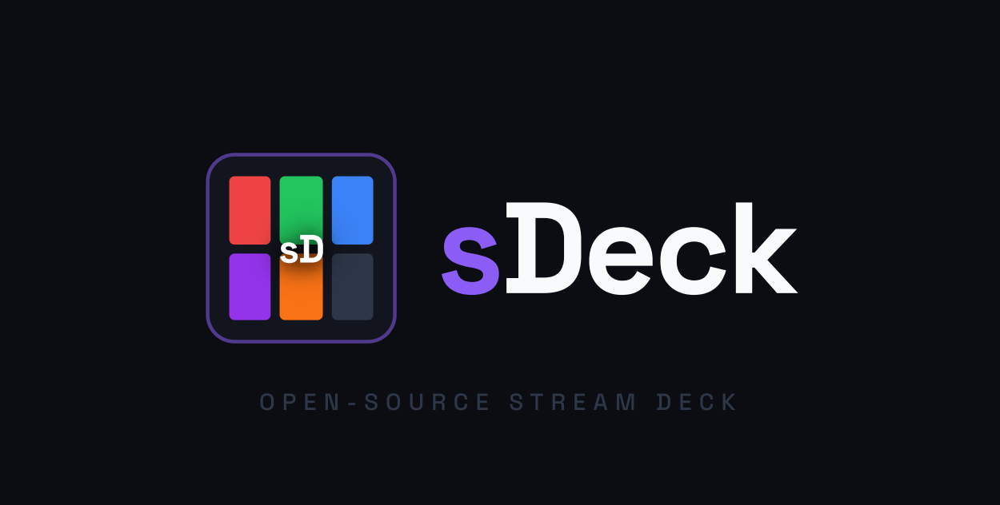

<div align="center">

  <!-- Logo -->
  

  # sDeck

  ### A Sleek, Low-Latency Web-Based Stream Deck & Overlay System for OBS, Spotify, Twitch, and Streamlabs

  [](https://nodejs.org/)
  [](https://obsproject.com/)
  [](https://opensource.org/licenses/MIT)
  [](https://makeapullrequest.com)

  *Transform any smartphone, tablet, or web browser into a custom Stream Deck controller, while serving beautiful retro-themed, realtime HTML overlays directly to OBS Studio.*

  <br/>
  
  <!-- Interface Preview -->
  

  <br/><br/>

  [Features](#features) • [Screenshots](#screenshots) • [Quick Start](#quick-start) • [Configuration](#configuration) • [Stream Overlays](#stream-overlays) • [Troubleshooting](#troubleshooting)

</div>

---

## Features

*   **Fully Self-Hosted & Local**: Runs completely on your local machine. No external servers or cloud accounts required.
*   **Multi-Device Wi-Fi Access**: Host on your streaming PC and open the deck interface on any phone, tablet, or laptop via your local network.
*   **Absolute PC & System Command**: Control Windows/Linux system volume, launch applications, trigger a local soundboard, or execute custom scripts.
*   **Custom Commands & Macros (PowerShell / CMD)**: Create, edit, and chain custom actions. Write PowerShell scripts, CMD commands, OBS requests, or Twitch chat macros to execute complex workflows with a single button press.
*   **OBS Studio Control**: Native WebSocket v5 integration to switch scenes, toggle sources, toggle streams/recording, and mute audio inputs.
*   **Companion API Integrations (Optional)**: Seamless secondary integrations with **Spotify** (now playing details, play, pause, volume, track progress), **Streamlabs** (realtime alerts and live events), and **Twitch Chat** (chat macro announcements).

---

## Screenshots

<details>
<summary>Click to expand dashboard screenshots</summary>
<br/>

### Stream Deck Interface


### Chat & Quick Moderation


### Soundboard & Sound Effects


### Connection & Credentials Panel


</details>

---

## Quick Start

sDeck is designed to bootstrap itself in a single step, automatically installing dependencies and generating template configurations.

### Prerequisites
*   [Node.js](https://nodejs.org/) (LTS version 18+ recommended).

### Launching sDeck
Choose the appropriate script for your Operating System:

#### Windows
Double-click `INICIAR.bat` in the root folder.

#### macOS / Linux
Open your terminal inside the project directory and run:
```bash
chmod +x start.sh
./start.sh
```

*The launcher will automatically configure environment files, install NPM packages, boot the server, and open your web dashboard at `http://localhost:3000`.*

---

## Configuration

Your private credentials, tokens, and button mappings are kept out of version control using local template copies.

### Configuration Files
On first startup, sDeck generates the following files in the root and `/config` directories:
*   `.env` — Manages the local server port and overlay social media handles.
*   `config/settings.json` — Stores OBS WebSocket credentials, Twitch tokens, and Spotify developer keys.
*   `config/profiles.json` — Saves your grid sizes, button layouts, labels, actions, and custom triggers.

### Editing Social Handles in `.env`
Open the `.env` file in your root folder and replace the placeholders to update the handles displayed on the overlays:
```env
PORT=3000
TWITCH_USERNAME=your_twitch_channel
TWITTER_HANDLE=@your_twitter
INSTAGRAM_HANDLE=@your_instagram
TIKTOK_HANDLE=@your_tiktok
YOUTUBE_HANDLE=@your_youtube
```

---

## External Integrations

### 1. OBS Studio (WebSocket v5.x)
1. Open OBS Studio and navigate to **Tools** -> **WebSocket Server Settings**.
2. Enable the WebSocket server (default port: `4455`).
3. Set a **Server Password** (recommended).
4. Enter the Port and Password in the sDeck Dashboard under **OBS Settings**.

### 2. Spotify API Developer App (Optional)
1. Go to the [Spotify Developer Dashboard](https://developer.spotify.com/dashboard).
2. Click **Create app**:
    *   **App name**: `sDeck Controller`
    *   **Redirect URI**: `http://127.0.0.1:3000/callback` (or your custom port, ending with `/callback`).
3. Save and copy the **Client ID** and **Client Secret**.
4. In the sDeck Dashboard, enter these credentials in the Spotify settings wizard and click **Connect**.

> [!WARNING]
> **Spotify Redirect Requirement**: Spotify enforces a strict security policy that bans `localhost` redirect URLs for development. You **must** use `http://127.0.0.1:[PORT]/callback` in both your Spotify Developer Dashboard and sDeck.

### 3. Twitch IRC (Optional)
To send chat announcements or macros:
1. Generate an OAuth chat token at [Twitchapps TMI Generator](https://twitchapps.com/tmi/).
2. Paste the token (beginning with `oauth:`) and your Twitch username into sDeck's settings.

### 4. Streamlabs Alerts (Optional)
To trigger alert screens and sounds:
1. Go to [Streamlabs API Settings -> API Tokens](https://streamlabs.com/dashboard#/settings/api-settings).
2. Copy the **Socket API Token** (starts with `eyJ...`).
3. Paste the token into sDeck's settings.

---

## Stream Overlays

Add these URLs as **Browser Sources** in OBS Studio:

| Overlay Name | URL | Recommended Width | Recommended Height |
| :--- | :--- | :--- | :--- |
| **Top Info Bar** | `http://localhost:3000/overlays/Top Bar.dc.html` | `1920` | `80` |
| **Socials Ticker** | `http://localhost:3000/overlays/Social Bar.dc.html` | `1920` | `66` |
| **Spotify Music Disc** | `http://localhost:3000/overlays/Now Playing - Disc.dc.html` | `350` | `100` |
| **Spotify Music Bars** | `http://localhost:3000/overlays/Now Playing - Bars.dc.html` | `380` | `120` |

---

## Troubleshooting

### Spotify returns `INVALID_CLIENT` or `redirect_uri_mismatch`
*   **Fix**: Verify that you are using `http://127.0.0.1:3000/callback` in the Spotify Developer Dashboard. Ensure it matches the address shown in the sDeck setup page exactly. Do not use `localhost` in the Spotify Developer settings.

### Server fails to bind to port (`EADDRINUSE`)
*   **Fix**: If port `3000` is already in use by another application, open `.env` and change `PORT=3000` to a different port (e.g. `PORT=4000`). Remember to update your Spotify Developer Dashboard Redirect URI to match (e.g. `http://127.0.0.1:4000/callback`).

### OBS connection state is disconnected
*   **Fix**: Check that OBS Studio is open, WebSocket Server is enabled under *Tools -> WebSocket Server Settings*, and the port/password match what you entered in the dashboard settings.
